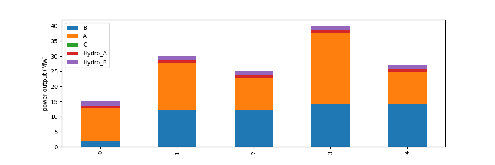

# linear-programming-power-plant-optim

Linear programming project that aim to optimise the use of different power plant types according to the electric demand
We consider 5 different periods p = [1, 2, 3, 4, 5] corresponding to different periods of the days.
( "0h-6h", "6h-9h", "9h-15h", "15h-18h", "18h-0h" ). For every period, there is a corresponding demand.
There are 3 different thermic plants and 2 hydraulic generator with different characteristics.

In every part of this work, constraints and elements are added to make the model more and more accurate.

"Example of a daily plan to operate the plants (See V.1)" :

